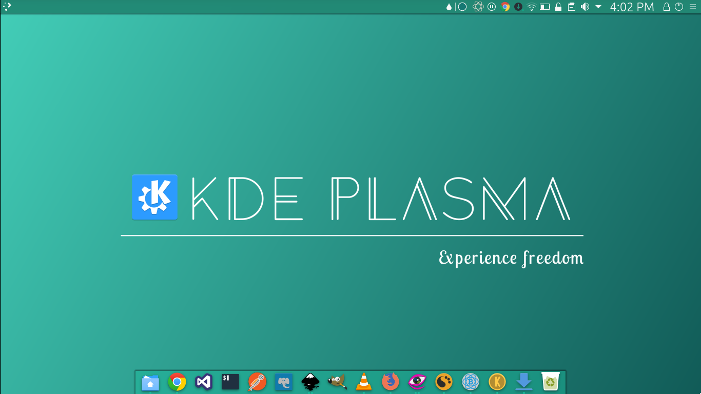

# KDE wallpapers



Follow [@kudapara](https://twitter.com/kudapara) on twitter for updates on kde-wallpapers

## Download Wallpapers
1. <a href="https://raw.githubusercontent/kudapra/kde-wallpapers/img/experience_freedom_by_kudapara.png" target="_blank">experience_freedom_by_kudapara</a>
## Contributing

[Fork](https://github.com/kudapara/kde-wallpapers#fork-destination-box) the repository and open your terminal and type the following

```sh
git clone https://github.com/<YOUR_GITHUB_USERNAME>/kde-wallpapers.git
```
* A folder named ```kde-wallpapers``` will be created in your home folder.
* Create a beautiful kde branded wallpaper using and image editor of your choice.
* Be sure to save the original image (e.g if you are using inkscape the original image will be a .svg file) in the ```kde-wallpapers/src``` folder and the generated png in the ```kde-wallpapers/png```.
* Commit your changes and push them to your repository.
* If you are satisfied with your work submit a pull request.
